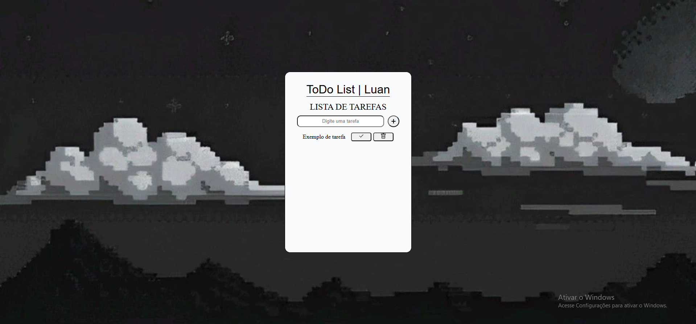

# 📝 To-Do List

Projeto de uma lista de tarefas (To-Do List) desenvolvido para praticar HTML, CSS, versionamento com Git/Github e futuramente JavaScript.

## 📌 Sobre o projeto
Este projeto representa a interface de uma aplicação de lista de tarefas.  
Atualmente, ele possui apenas o front-end desenvolvido, com foco em estrutura e estilização.

## 🚀 Tecnologias utilizadas
- HTML5
- CSS3

## 🎯 Funcionalidades atuais
- Interface de lista de tarefas
- Campo de input para adicionar tarefas
- Botões de ação (ainda não funcionais)

## 🔧 Próximos passos
- Implementar funcionalidade com JavaScript
- Adicionar criação de tarefas
- Marcar tarefas como concluídas
- Remover tarefas
- Armazenamento local (localStorage)

## 💻 Como executar
1. Baixe o projeto
2. Abra o arquivo `index.html` no navegador

## 📷 Preview

## 📁 Status do projeto
🚧 Em desenvolvimento